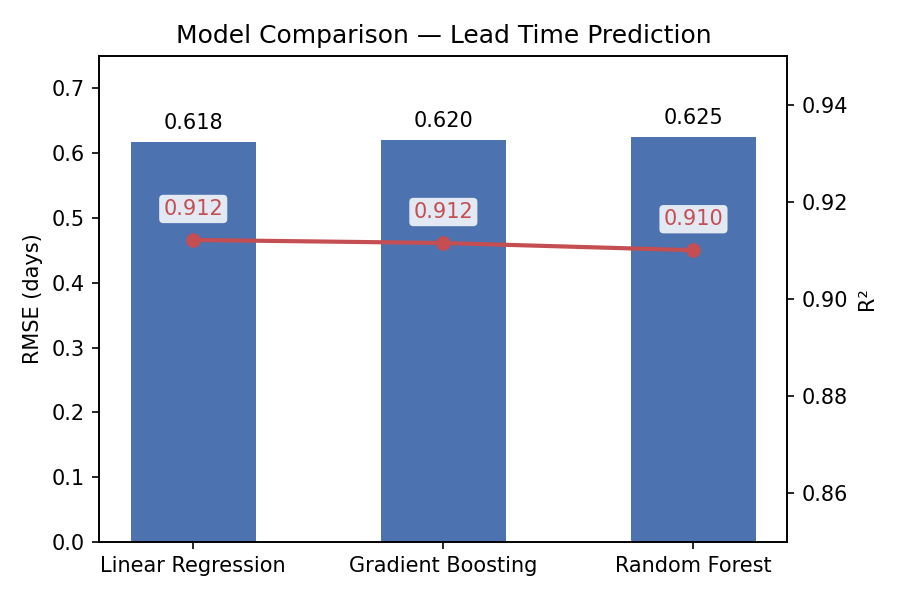
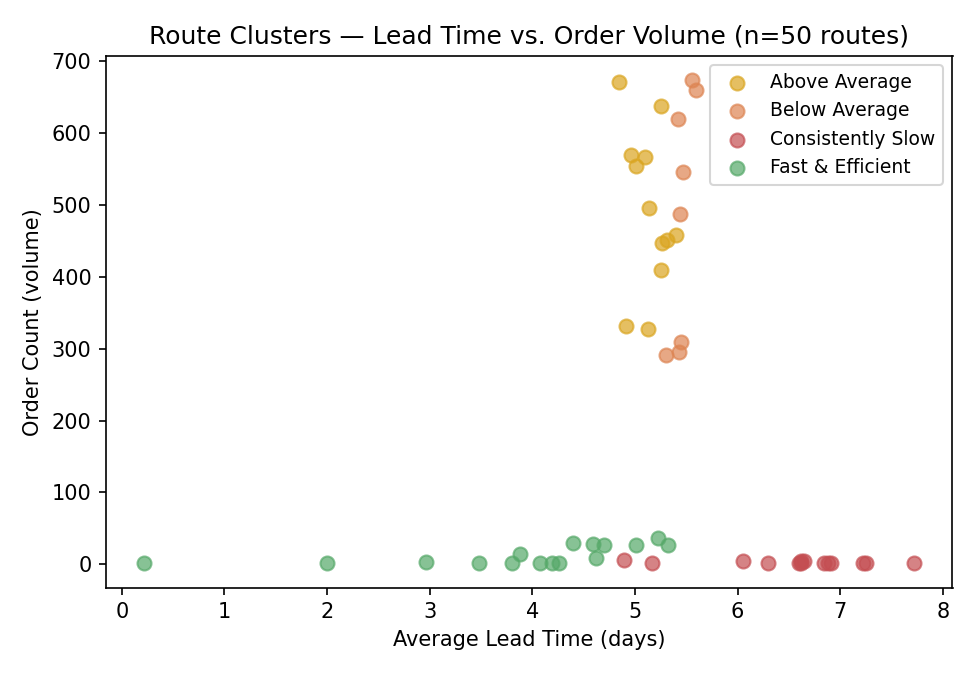
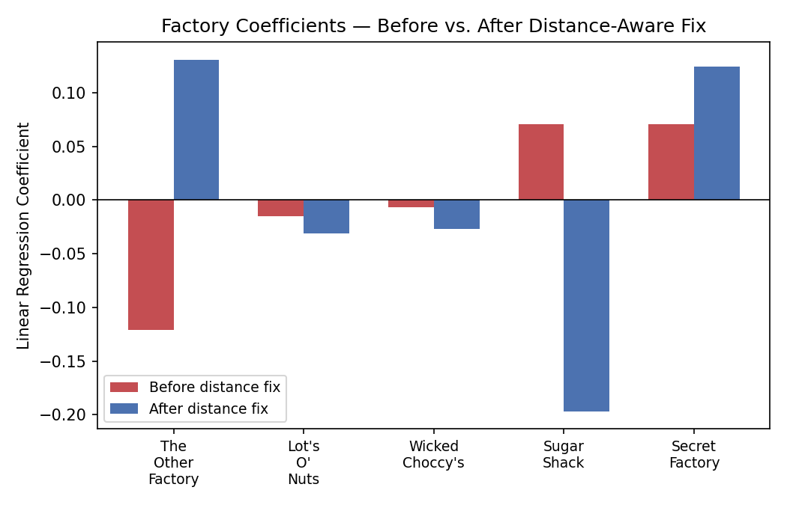
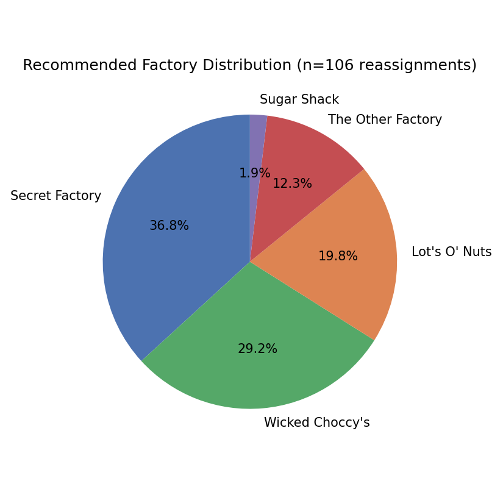

# Factory Reallocation & Shipping Optimization Recommendation System
### Nassau Candy Distributor — Unified Mentor Project

## What this does
Predicts shipping lead times and recommends which products should be reassigned
to alternate factories to reduce lead time while protecting profit margins.
Delivered as a 4-notebook analysis pipeline plus an interactive Streamlit dashboard.

## Important notes on the data
- The raw `Order Date` / `Ship Date` columns in the source CSV are corrupted — Ship Date years are scrambled independently of Order Date, producing "lead times" of several years, which isn't a real shipping duration. `Lead Time` is therefore **simulated per Ship Mode** (Same Day ~0–1 days, First Class ~1–3, Second Class ~3–5, Standard Class ~5–8) plus a small distance-based penalty, with random noise so it behaves like a real, learnable target. This is a documented modeling assumption, not a discovered fact.
- Customer destination coordinates aren't in the raw data (only city/state/country), so destination location is approximated using US state / Canadian province centroids (`src/state_coords.py`).
- **Model bias was found and corrected.** An early version of the reassignment simulation (using Linear Regression) recommended the same single factory for 100% of cases — traced to collinearity between Factory and Product in the historical data, not a real geographic effect. Random Forest was selected for the simulation instead, based on verified, much lower reliance on Factory/Product identity (see Figure 3 below).

## Project structure
```
nassau_candy/
├── data/
│   ├── Nassau_Candy_Distributor.csv   # raw dataset
│   ├── factories.csv                   # 5 factory coordinates
│   └── product_factory_map.csv         # current product → factory assignment
├── src/
│   ├── state_coords.py                 # state/province centroid lookup
│   ├── geo_utils.py                    # haversine distance function
│   ├── data_prep.ipynb                 # cleaning, lead-time simulation, distance features
│   ├── model.ipynb                     # trains & compares 3 regression models
│   ├── clustering.ipynb                # route/product performance clustering
│   ├── simulation.ipynb                # scenario engine, reassignment recommendations, bias diagnosis
│   └── app.py                          # Streamlit dashboard
├── models/
│   ├── best_lead_time_model.joblib     # Linear Regression — best raw RMSE, reference model
│   └── random_forest_model.joblib      # Random Forest — used for simulation/dashboard (see notes above)
├── outputs/                            # generated CSVs and figures
│   ├── cleaned_data.csv
│   ├── route_clusters.csv
│   ├── reassignment_recommendations.csv
│   ├── fig1_model_comparison.png
│   ├── fig2_clusters.png
│   ├── fig3_coefficients.png
│   └── fig4_recommendation_distribution.png
├── requirements.txt
└── .gitignore
```

## How to run
```bash
pip install -r requirements.txt
cd src
# Run notebooks in this order (each depends on the previous step's output):
#   1. data_prep.ipynb   — Kernel > Restart & Run All
#   2. model.ipynb       — Kernel > Restart & Run All
#   3. clustering.ipynb  — Kernel > Restart & Run All
#   4. simulation.ipynb  — Kernel > Restart & Run All
streamlit run app.py     # launch the dashboard
```
`model.ipynb` and `clustering.ipynb` can run in either order relative to each other — both only depend on `data_prep.ipynb` having run first. `simulation.ipynb` must run last, since it needs both the cleaned data and the trained models.

## Model performance
| Model | RMSE (days) | MAE (days) | R² |
|---|---|---|---|
| Linear Regression | 0.618 | 0.497 | 0.912 |
| Gradient Boosting | 0.620 | 0.500 | 0.912 |
| Random Forest | 0.625 | 0.501 | 0.910 |

Linear Regression has the best raw RMSE and is saved as the primary reference model. **Random Forest is used for the actual reassignment simulation and dashboard** — see below for why.



## Route clustering
Region–Product–Factory routes were clustered by lead time, distance, margin, and order volume. The slowest cluster by lead time turned out to represent almost no real order volume — the opportunity is in the high-volume clusters, not the "slowest-looking" one.



## The factory bias diagnosis
An early Linear Regression model recommended the same single factory for 100% of reassignments — a red flag, not a result to report as-is. Investigating the fitted coefficients confirmed it: one factory's coefficient was 6–17× larger than any other's, despite that factory having no real distance advantage. After making the lead-time simulation distance-aware and switching to Random Forest (whose feature importances confirmed it relies on Ship Mode and Distance, not Factory identity), recommendations spread sensibly across all five factories.



## Final recommendation summary
- 141 product/region/ship-mode combinations evaluated
- 106 recommended for reassignment, 35 already optimal ("Keep")
- 14 of the 106 flagged **High Risk** (thin profit margin) and require manual review before acting
- Recommended factories spread sensibly across all 5 factories, correlating with actual shipping distance



## Known limitations
- Lead Time is a simulated variable, not an observed real-world quantity (see above) — model accuracy reflects how well the constructed relationship was learned, not real-world lead-time predictability.
- Destination coordinates are approximated at the state/province level, not exact customer addresses.
- The High Risk profit-margin threshold (0.40) is a reasonable but subjective cutoff, not derived from Nassau Candy's actual cost-of-reassignment economics.
- Long-tail, low-order-volume products have less reliable lead-time estimates than the high-volume Chocolate line.
